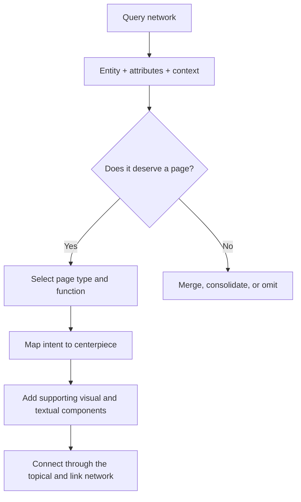
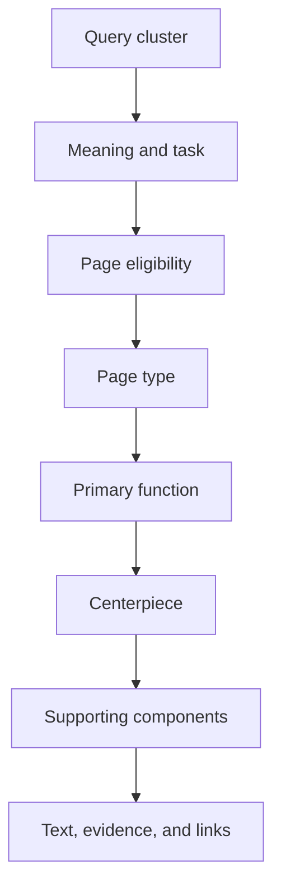

# Keyword and Query Intent to Visual Element Mapping

## Knowledge Base for Semantic and Topical Local SEO

**Primary source:** [How semantics and topical authority improve local SEO](https://searchengineland.com/how-semantics-and-topical-authority-improve-local-seo-482980)  
**Related source:** [Visual semantics: The missing piece of topical authority](https://searchengineland.com/visual-semantics-topical-authority-482254)

## 1. Central Idea

The article’s main operational outcome is not merely **keyword → visual element**. The stronger model is:

> **Query context → search activity → page decision → page function → visual component → supporting content and links**

A query should first determine whether a page is needed. Its intent should then guide the page type, centerpiece, functional components, content structure, and internal links.



## 2. The Larger Framework

The article combines four connected systems:

| System | Main question | Output |
|---|---|---|
| Query semantics | What does the searcher mean and want to accomplish? | Intent, entity, attributes, and context |
| Page eligibility | Does this variation require its own URL? | Create, merge, consolidate, or omit |
| Visual semantics | What kind of page and interface fulfil the task? | Page type, centerpiece, and components |
| Topical authority | How does this page support the wider site subject? | Content network, internal links, and authority signals |

**Keyword or query intent to visual element mapping** belongs mainly to the third system. It becomes more useful when the first two systems feed it.

---

# Part I: Query Semantics

## 3. Query Versus Keyword

A **query** is what someone searches.

A **keyword** is the label an SEO team uses to group similar queries.

Example:

- Queries: “AC installation cost,” “how much does central air installation cost?” and “new AC price near me.”
- Keyword cluster: AC installation cost.
- Shared activity: estimating cost before contacting a provider.

The visual decision should normally follow the query cluster’s shared task, not one exact keyword string.

## 4. Entity

An entity is the main identifiable subject.

Examples:

- Air conditioner
- HVAC contractor
- AC installation
- Houston
- Heat pump

A local service page normally involves several connected entities:

- Business
- Service
- Location
- Equipment
- Customer problem
- Provider credentials

## 5. Attribute

An attribute is a property or aspect of an entity.

For an HVAC installation entity, attributes might include:

- Price
- Installation time
- Equipment type
- Capacity
- Warranty
- Energy efficiency
- Service area
- Provider rating

Attributes help determine which sections or functional components the page needs.

## 6. Value

A value is the information assigned to an attribute.

Example:

> Air conditioner installation → average duration → [verified duration]

If no verified value exists, the page should explain the factors involved instead of inventing a number.

## 7. Entity to Attribute to Value Relationship

This is a basic factual unit behind semantic content.

Examples:

> Service → warranty → warranty terms  
> Contractor → service area → named locations  
> Installation → price → verified range

The article discusses entity to attribute to context relationships as well. Context may replace or qualify the value:

> AC installation → price → in Houston  
> Drain cleaning → customer experience → emergency appointment

## 8. Query Template

A query template is a repeatable search pattern.

Examples:

> `[service] in [location]`  
> `[service] cost in [location]`  
> `best [provider type] in [location]`  
> `how to [complete task]`

A topical map should process meaningful template variations rather than generate every possible service-location combination.

## 9. Query Variation

A query variation is a different expression of the same or a related search need.

Examples:

- AC installation price
- Cost to install central air
- New air conditioner installation cost
- HVAC installation estimate

Variations should be grouped when they share the same entity, task, evidence requirement, and likely page function.

## 10. Query Augmentation

Search systems may expand a short query into related concepts needed to interpret it.

For example:

> “AC installation price”

may imply:

- Equipment cost
- Labor
- Home size
- Energy efficiency
- Permits
- Comparisons
- Quotation

The page should handle important implied attributes without mechanically repeating the original phrase.

## 11. Search Intent Versus Search Activity

Broad intent categories include:

- Informational
- Commercial
- Transactional
- Navigational
- Local

Search activity is more precise because it describes the task the searcher wants to complete.

Compare:

- Learn what AC installation means.
- Compare AC installation options.
- Estimate installation cost.
- Find an installer.
- Verify whether an installer serves an address.
- Book an installation consultation.

All six relate to AC installation, but each requires a different functional response.

Google’s quality guidelines recognize different user needs such as Know, Do, Website, and Visit-in-Person. They note that queries may carry multiple possible intents. The guidelines distinguish the page’s main content from supplementary content as well.

Source: [Google Search Quality Rater Guidelines](https://static.googleusercontent.com/media/guidelines.raterhub.com/en/assets/searchqualityevaluatorguidelines.pdf)

## 12. Search Activity as the Mapping Bridge

Search activity connects query research with page design.

| Search activity | User’s expected outcome |
|---|---|
| Learn | Understand a subject |
| Compare | Evaluate alternatives |
| Calculate | Obtain a result from supplied inputs |
| Estimate | Understand a likely range or scenario |
| Diagnose | Identify a cause or suitable next step |
| Verify | Confirm a claim, qualification, location, or reputation |
| Locate | Find a provider, product, or place |
| Book | Schedule an appointment |
| Purchase | Complete a transaction |
| Review | Read or contribute experiences |

---

# Part II: Topical Authority and Page Eligibility

## 13. Topical Coverage

Topical coverage is how thoroughly a website handles relevant entities, attributes, relationships, questions, and search activities within its legitimate subject area.

Coverage does not mean publishing every keyword variation. It means handling the meaningful parts of the topic.

## 14. Topical Relevance

Topical relevance describes how closely a page or website matches a particular query context.

A drain-cleaning guide may be relevant to plumbing, but it may not respond adequately to someone seeking an emergency plumber in a specific city.

## 15. Topical Authority

The article treats topical authority as the result of connected topical coverage, historical performance, document quality, internal authority distribution, external support, and clear page presentation.

The author expresses the idea through this conceptual formula:

> `((Historical data × topical coverage) ÷ retrieval cost) × appropriate visual annotations`

This is a practitioner model. It is not a published Google scoring formula.

## 16. Topical Map

A topical map is a structured model covering:

- Core entities
- Entity attributes
- Query templates
- Query variations
- Search activities
- Pages and URL relationships
- Internal links
- Required page components

A complete topical map should contain page-function and visual-component fields, not only keywords and URLs.

## 17. Semantic Content Network

A semantic content network is the collection of pages that jointly explain the subject.

For a plumbing company, this could include:

- Primary service pages
- Service-location pages
- Cost resources
- Problem and symptom guides
- Process pages
- Equipment or material pages
- Case studies
- FAQs
- Business and trust pages

Their relationships should remain clear through contextual internal links.

Google states that links help it discover pages and understand their relevance. It recommends descriptive anchors and at least one internal link to every important page.

Source: [Google Search Central: Link best practices](https://developers.google.com/search/docs/crawling-indexing/links-crawlable)

## 18. Query Deserves a Page

“Query Deserves a Page,” or QDP, is a planning framework used in the article. It asks whether a query variation requires an independent URL.

A separate page becomes more defensible when it has:

- A distinct search activity
- A distinct entity or service
- Meaningfully different information requirements
- A different centerpiece or function
- Sufficient unique evidence
- A clear position in the internal-link network

A separate page becomes less defensible when:

- Only the city name changes
- The content remains nearly identical
- The same component and answer satisfy both queries
- The business lacks location-specific evidence
- Two pages compete for the same search activity

Possible decisions:

1. Create a dedicated page.
2. Cover the subject as a section of an existing page.
3. Merge two overlapping pages.
4. Redirect a redundant URL.
5. Omit the variation.

This decision must occur before visual mapping.

## 19. Content Pruning and Consolidation

Content pruning removes or restructures pages that weaken the content network.

Possible actions include:

- Delete a page with no distinct purpose.
- Merge overlapping pages.
- Redirect an obsolete page to the closest suitable destination.
- Improve a valuable but incomplete page.
- Keep a page that serves a distinct entity, intent, or task.

The purpose is not simply to reduce URL count. The purpose is to improve:

- Page distinctiveness
- Internal authority concentration
- Crawl efficiency
- Query-to-page clarity
- Content maintenance

## 20. Retrieval Cost

Retrieval cost is the author’s way of describing the effort required for a search system to crawl, interpret, classify, and evaluate a document.

A page may raise interpretation difficulty when:

- Its purpose is unclear.
- The main answer is buried.
- Components lack meaningful labels.
- Important content is mixed with boilerplate.
- Several pages provide nearly identical answers.
- Important relationships are available only through scripts or images.

Clear structure, meaningful HTML, distinct page purposes, and focused content reduce unnecessary interpretation.

---

# Part III: Visual Semantics

## 21. Definition

Visual semantics concerns how page layout, grouping, hierarchy, HTML structure, component type, and functionality communicate meaning.

It is not merely decorative design.

A price table, calculator, review carousel, service-area map, booking form, ordered process, comparison grid, and gallery each communicate a different page purpose.

The author’s related article defines visual semantics as a model for understanding documents alongside textual semantics. It argues that search systems examine layout, functional components, hierarchy, and structured information blocks, not only prose.

Source: [Search Engine Land: Visual semantics](https://searchengineland.com/visual-semantics-topical-authority-482254)

## 22. Textual Semantics Versus Visual Semantics

| Textual semantics | Visual semantics |
|---|---|
| Meaning communicated through words and sentences | Meaning communicated through layout, hierarchy, grouping, and function |
| Entities, attributes, predicates, and relationships | Cards, tables, forms, calculators, maps, galleries, and navigation |
| Explains what the page says | Explains what the page does and prioritizes |
| Depends on headings, prose, and labels | Depends on position, component type, interaction, and structure |

Strong pages align both systems.

## 23. Centerpiece Annotation

The centerpiece is the page’s primary content or function.

Examples:

| Page purpose | Likely centerpiece |
|---|---|
| Calculate | Working calculator |
| Compare | Comparison table or product grid |
| Hire locally | Service, location, proof, and contact action |
| Troubleshoot | Diagnostic steps or decision tree |
| Check service eligibility | Address, ZIP, or service-area checker |
| Review reputation | Verified review summary and evidence |
| Learn a process | Ordered guide with diagrams or video |

The centerpiece should make the page’s purpose apparent early. Moving the core tool beneath generic introductions may weaken that clarity.

## 24. Macro-Context

The macro-context is the high-priority section, generally near the top of the page.

It should establish:

- Main entity
- Primary task
- Location context when relevant
- Main answer or functional element
- Primary supporting proof
- Next action

## 25. Micro-Context

The micro-context contains supporting sections lower on the page:

- Secondary attributes
- Detailed explanations
- FAQs
- Related services
- Internal links
- Supporting evidence
- Definitions
- Edge cases

The macro-context answers, “Why does this page exist?” The micro-context expands, proves, and connects that answer.

## 26. Main Content and Supplementary Content

Google’s quality guidelines separate:

- **Main Content:** Content that directly helps the page achieve its purpose.
- **Supplementary Content:** Content that supports navigation, exploration, or understanding without serving as the primary answer.

This distinction relates to macro- and micro-context, but the terms should not be treated as exact synonyms.

## 27. Relevance Versus Responsiveness

- **Relevance:** The page discusses the correct subject.
- **Responsiveness:** The page helps complete the searcher’s task.

A page discussing plumbing prices is relevant to “plumbing cost calculator.” Without estimates, calculations, or a structured way to understand cost, it may not respond adequately to the task.

## 28. Functionality

A functional component helps the user complete an action.

Examples:

- Calculate
- Compare
- Filter
- Locate
- Verify
- Book
- Purchase
- Upload
- Review
- Diagnose

A component should perform its stated action. A visual imitation of a calculator, comparison interface, or booking function does not meet the task.

## 29. Commercialization

Commercialization means adding functional components that help users move through a commercial task.

Examples:

- Request a quotation
- Select a service option
- Compare plans
- Check eligibility
- Schedule an appointment
- View verified pricing conditions

Commercialization should support the query rather than dominate an informational page.

## 30. Contextualization

Contextualization keeps information aligned with the current entity, query, location, and task.

For example, a national cost table may not fully answer a location-specific price query. A location page should not insert unrelated national statistics merely to add length.

## 31. Verbalization

Important information shown visually should have machine-readable textual support.

Examples:

- A comparison grid needs clear HTML labels.
- A chart needs headings, labels, and an explanation.
- A gallery needs captions and relevant alt text.
- Tabs and accordions need rendered, accessible content.
- A service map needs a textual service-area list.
- A calculator needs labels explaining inputs, outputs, and assumptions.

## 32. Visual Semantics Versus Structured Data

Visual semantics and structured data are different.

- Structured data identifies entities and properties in code.
- Visual semantics communicates page purpose through the rendered interface.

They may reinforce each other when the visible information and structured data describe the same facts.

## 33. Factual, Opinionated, Structured, and Unstructured Content

The related visual-semantics article separates several content forms:

| Content form | Suitable use |
|---|---|
| Factual | Definitions, specifications, rules, and verified data |
| Opinionated | Experience, interpretation, preference, and discussion |
| Structured | Symptoms, features, benefits, steps, and comparisons |
| Unstructured | Explanations, context, importance, and narrative |

The correct mix depends on the search activity.

Examples:

- “AC efficiency rating definition” needs factual and structured information.
- “What is it like to replace central air?” may need experience-based and less structured content.
- “AC replacement advantages” may work well as structured benefits supported by evidence.
- “Why AC sizing matters” may require a connected explanatory narrative.

---

# Part IV: Intent-to-Visual Mapping

## 34. Initial Mapping Model

| Query activity | Page function | Primary component | Supporting components |
|---|---|---|---|
| Find a local provider | Qualify and contact a provider | Local service hero with clear action | Service area, credentials, reviews, and contact options |
| Compare providers or options | Support evaluation | Comparison table or card grid | Criteria explanations, reviews, and filters |
| Check price | Explain or estimate cost | Price answer, range table, or calculator | Cost factors, scenarios, and quotation action |
| Learn how to complete a task | Teach the process | Ordered guide | Tools, safety notes, images, and video |
| Diagnose a problem | Narrow possible causes | Diagnostic flow or symptom table | Warning signs, next steps, and service action |
| Verify reputation | Establish trust | Review and evidence section | Case examples, third-party sources, and credentials |
| Check geographic eligibility | Confirm service availability | Service-area map or location checker | City list, boundaries, and travel terms |
| Book or request service | Complete a transaction | Booking or enquiry interface | Availability information and process expectations |
| Seek lived experience | Present experience-based answers | Q&A or discussion format | Voting, author context, and related experiences |

## 35. Air Conditioner Examples from the Related Article

The source uses air conditioner queries to explain the relationship between query variation, page type, and visual structure.

| Query | Search activity | Suggested structure |
|---|---|---|
| “How do I repair my AC?” | Experience or troubleshooting | Forum, Q&A, diagnostic, or troubleshooting format |
| “AC installation in [city]” | Find a local provider | Local directory or listing page in the source project |
| “AC installation prices” | Research cost before a decision | Informational-commercial hybrid |
| “How to install an air conditioner” | Learn a procedure | Instructional guide |

The directory recommendation applies to a local service directory project. A single HVAC company would normally need a service landing page rather than a provider directory.

## 36. Local Service Mapping Examples

### Emergency service query

**Query pattern:** `emergency [service] in [location]`

**Likely search activity:** Find and contact a suitable provider quickly.

**Primary component:**

- Clear service and location statement
- Immediate contact or request action

**Supporting components:**

- Verified availability
- Service boundaries
- Relevant credentials
- Emergency process
- Authentic reviews
- Response expectations supported by the business

### Cost query

**Query pattern:** `[service] cost in [location]`

**Likely search activity:** Estimate expense and decide whether to contact a provider.

**Primary component:**

- Verified price range, estimator, or scenario table

**Supporting components:**

- Cost factors
- Included and excluded items
- Example scenarios
- Date and source of price information
- Quotation request

### Comparison query

**Query pattern:** `best [provider or option] in [location]`

**Likely search activity:** Compare and shortlist.

**Primary component:**

- Comparison criteria or evidence-led selection interface

**Supporting components:**

- Reviews
- Credentials
- Service differences
- Case evidence
- Transparent selection methodology

A business should not call itself “best” without defensible evidence.

### Instructional query

**Query pattern:** `how to [complete task]`

**Likely search activity:** Complete or understand a procedure.

**Primary component:**

- Ordered instructions

**Supporting components:**

- Tools
- Materials
- Safety notes
- Images
- Video
- Common errors
- Professional-service threshold

### Diagnostic query

**Query pattern:** `why is [equipment or system] [symptom]`

**Likely search activity:** Identify possible causes and next steps.

**Primary component:**

- Symptom-to-cause table or diagnostic flow

**Supporting components:**

- Safe checks
- Warning signs
- Severity levels
- Repair-versus-replace considerations
- Contact action where suitable

### Reputation query

**Query pattern:** `[business or provider] reviews`

**Likely search activity:** Verify experience and trust.

**Primary component:**

- Authentic review evidence

**Supporting components:**

- Review source
- Date
- Service context
- Business response
- Case studies
- Third-party profile links

---

# Part V: Visual Component Library

## 37. Common Components and Their Semantic Roles

| Component | Semantic role | Suitable query activities |
|---|---|---|
| Hero section | Declares the primary entity, context, and action | Locate, hire, book, understand |
| Calculator | Produces an answer from user inputs | Calculate, estimate |
| Comparison table | Displays repeated attributes across options | Compare, evaluate |
| Card grid | Represents distinct items or entities | Browse, compare, select |
| Review carousel | Presents experience and reputation evidence | Verify, evaluate |
| Q&A module | Connects questions with answers or experiences | Learn, troubleshoot, review |
| FAQ accordion | Handles secondary questions | Clarify, understand |
| Process stepper | Communicates order and progression | Learn, prepare, book |
| Diagnostic tree | Narrows possible causes or actions | Diagnose |
| Map | Communicates geographic relationships | Locate, verify coverage |
| Location checker | Confirms service or delivery eligibility | Verify location |
| Gallery | Shows visual evidence or examples | Evaluate, verify quality |
| Before-and-after slider | Shows change over time | Evaluate results |
| Filter | Narrows a large collection | Browse, compare |
| Tabs | Separates related subcontexts | Explore attributes |
| Pricing table | Compares plans, ranges, or inclusions | Estimate, compare |
| Booking form | Completes an appointment task | Book |
| Quotation form | Starts a pricing or scope request | Estimate, hire |
| Checklist | Supports completion or verification | Prepare, inspect |
| Timeline | Shows sequence or duration | Understand process |
| Video | Demonstrates movement, procedure, or experience | Learn, evaluate |

## 38. Component Selection Rules

1. Identify the main entity.
2. Identify the primary attribute or problem.
3. Identify the user’s intended action.
4. Decide whether the query requires its own page.
5. Select the page type that supports the action.
6. Select one primary task-completing component.
7. Place the primary answer or function within the macro-context.
8. Add components for secondary attributes.
9. Verbalize important visual information in accessible text.
10. Link the page to its parent, sibling, and supporting pages.
11. Remove components that do not support the query.
12. Validate whether users complete the intended task.

---

# Part VI: Local SEO Context

## 39. Official Local Ranking Framework

Google explains local ranking mainly through:

- Relevance
- Distance
- Prominence

Source: [Google Business Profile Help: Tips to improve your local ranking](https://support.google.com/business/answer/7091)

Visual semantics may help clarify relevance, page purpose, service eligibility, and user experience. It does not remove the effects of distance, competition, reputation, or prominence.

## 40. Local Relevance

Local relevance connects:

- Business entity
- Service entity
- Location entity
- Service-area evidence
- On-page context
- Google Business Profile information
- Reviews
- Citations
- Links

A city name repeated across generic pages does not create strong local relevance by itself.

## 41. Local Page Evidence

A location page becomes stronger when it contains genuine location-specific evidence such as:

- Services supplied in the area
- Real project examples
- Area-specific photographs
- Local customer reviews
- Service boundaries
- Local regulations or conditions when relevant
- Staff or office information when truthful
- Directions or access information for visitable businesses

Do not create unsupported local details.

## 42. Local Intent Types

| Local intent | Expected page response |
|---|---|
| Provider selection | Service, location, proof, and contact |
| Service eligibility | Coverage confirmation |
| Reputation verification | Reviews, credentials, and cases |
| Local price research | Sourced ranges and local factors |
| Visit planning | Address, hours, directions, and access |
| Emergency contact | Immediate action and verified availability |
| Local comparison | Selection criteria and provider evidence |

---

# Part VII: Tool and Checklist Foundation

## 43. Recommended Tool Inputs

The eventual tool should accept more than a keyword.

Suggested fields:

```text
Query cluster
Primary keyword
Actual query examples
Entity
Primary attribute
Location context
Searcher activity
Decision stage
Evidence type required
Page type
QDP decision
Primary function
Centerpiece
Supporting components
Required textual explanation
Internal-link role
Validation evidence
```

## 44. Recommended Tool Logic

The central rule should be:

> Map the search activity to a task-completing function, then map that function to a centerpiece and supporting components.



## 45. Suggested Tool Outputs

The tool could produce:

- Page creation decision
- Recommended URL role
- Primary search activity
- Page type
- Centerpiece component
- Supporting component list
- Required entity and attribute coverage
- Evidence requirements
- Macro-context outline
- Micro-context outline
- Internal-link recommendations
- Consolidation warnings
- Unsupported-claim warnings
- Visual-verbalization requirements
- Measurement plan

## 46. Page Audit Checklist

### Query alignment

- [ ] Is the target query cluster defined?
- [ ] Are actual query examples included?
- [ ] Is the main entity clear?
- [ ] Are the important attributes identified?
- [ ] Is the location context explicit or implicit?
- [ ] Is the main search activity defined?

### Page eligibility

- [ ] Does this query need a separate page?
- [ ] Does the page serve a distinct intent or task?
- [ ] Does it contain unique evidence?
- [ ] Does another URL already serve the same activity?
- [ ] Should the content be merged or consolidated?

### Page function

- [ ] Does the selected page type fit the task?
- [ ] Does the page help the user complete the task?
- [ ] Is the primary function real and usable?
- [ ] Is the commercial action suitable for the query?

### Centerpiece

- [ ] Is the primary answer or function easy to identify?
- [ ] Does it appear early in the page?
- [ ] Does it align with the main query activity?
- [ ] Is generic copy delaying the answer?

### Supporting components

- [ ] Does every major component support an attribute or user task?
- [ ] Are comparison elements structured consistently?
- [ ] Are review elements authentic and sourced?
- [ ] Are maps supported with textual location information?
- [ ] Are calculators and forms clearly labelled?

### Content semantics

- [ ] Are entities, attributes, values, and context connected clearly?
- [ ] Are claims supported?
- [ ] Are unknown facts left unstated or marked for verification?
- [ ] Does the content avoid unnecessary repetition?
- [ ] Does the page answer implied query attributes?

### Visual verbalization

- [ ] Does important visual information have textual support?
- [ ] Are headings and labels meaningful?
- [ ] Is tabbed or accordion content accessible?
- [ ] Do images have suitable alternative text?
- [ ] Do charts, maps, and tables include explanations?

### Internal relationships

- [ ] Does the page link to its parent topic?
- [ ] Does it link to useful sibling or supporting pages?
- [ ] Do internal anchors describe the destination?
- [ ] Do important pages receive sufficient internal links?
- [ ] Are unrelated links kept outside the main context?

### Local evidence

- [ ] Is the service-location relationship genuine?
- [ ] Is service-area information accurate?
- [ ] Are local reviews and projects real?
- [ ] Are business details consistent with the Google Business Profile?
- [ ] Are location-specific claims verified?

### Measurement

- [ ] Is the intended user action measurable?
- [ ] Are form submissions or bookings tracked?
- [ ] Are calculator or filter interactions tracked where relevant?
- [ ] Are query clusters monitored in Search Console?
- [ ] Are consolidation and redesign changes documented?

---

# Part VIII: Evidence and Limitations

## 47. Evidence Levels in the Article

The article blends several evidence levels.

### Confirmed through Google documentation

- Local ranking considers relevance, distance, and prominence.
- Links help Google discover pages and interpret relevance.
- Search quality evaluation considers page purpose, main content, user needs, and locale.

### Supported by patents and research

- Search systems may interpret page layout, cards, visual groupings, and functional components.
- Multimodal systems may process text, images, document structure, and layout together.

Patents indicate methods that researchers developed or considered. They do not prove that every described method is active in live ranking.

### Supported by practitioner case studies

- Layout changes may coincide with ranking and traffic changes.
- Moving a primary tool higher may improve page clarity and performance.
- Consolidating overlapping pages may concentrate relevance and internal authority.

These case studies provide directional evidence. They are not controlled experiments.

## 48. Important Distinctions

Do not treat these concepts as identical:

| Concept A | Concept B | Difference |
|---|---|---|
| Query | Keyword | Actual search expression versus SEO grouping label |
| Intent | Search activity | Broad category versus specific task |
| Relevance | Responsiveness | Subject match versus task fulfilment |
| Topical coverage | Topical authority | Subject completeness versus accumulated authority |
| Textual semantics | Visual semantics | Meaning in language versus meaning in layout and function |
| Visual semantics | Structured data | Rendered interface meaning versus machine-readable markup |
| Main content | Above-the-fold content | Purpose-defining content versus viewport position |
| QDP | Search volume threshold | Page-purpose decision versus demand metric |
| Patent evidence | Confirmed ranking factor | Technical possibility versus verified production use |

## 49. Final Working Model

The strongest practical interpretation is:

> **Topical maps define what the site must cover. QDP defines which URLs should exist. Query activity defines what each URL must do. Visual semantics defines how that purpose should appear and function. Internal and external relationships establish the page’s place in the wider authority network.**

The future system should therefore use:

> **Query cluster → entity and attributes → search activity → QDP decision → page type → primary function → centerpiece → supporting elements → textual verbalization → evidence → internal links → measurement**

---

# Sources

1. [How semantics and topical authority improve local SEO : Search Engine Land](https://searchengineland.com/how-semantics-and-topical-authority-improve-local-seo-482980)
2. [Visual semantics: The missing piece of topical authority : Search Engine Land](https://searchengineland.com/visual-semantics-topical-authority-482254)
3. [Google Search Quality Rater Guidelines](https://static.googleusercontent.com/media/guidelines.raterhub.com/en/assets/searchqualityevaluatorguidelines.pdf)
4. [Google Search Central: Link best practices](https://developers.google.com/search/docs/crawling-indexing/links-crawlable)
5. [Google Business Profile Help: Tips to improve your local ranking](https://support.google.com/business/answer/7091)

